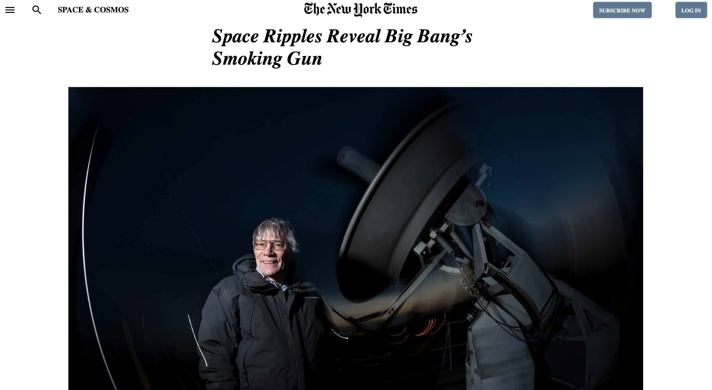

# New York Times Clone

> Cloning [this](https://www.nytimes.com/2014/03/18/science/space/detection-of-waves-in-space-buttresses-landmark-theory-of-big-bang.html?_r=0) page from New York Times as part of Microverse Main Curriculum to learn CSS and HTML.

Additional description about the project and its features.

## Built With

- CSS,
- HTML

## Live Demo

[Live Demo Link]()

## Getting Started

**This is an example of how you may give instructions on setting up your project locally.**
**Modify this file to match your project, remove sections that don't apply. For example: delete the testing section if the currect project doesn't require testing.**

## Authors

👤 **Shingirayi Mandebvu**

- Github: [@simandebvu](https://github.com/simandebvu)
- Twitter: [@simandebvu](https://twitter.com/simandebvu)
- Linkedin: [simandebvu](https://linkedin.com/simandebvu)

👤 **Santiago Rodriguez Bermudez**

- Github: [@santiagorodriguezbermudez](https://github.com/santiagorodriguezbermudez)
- Twitter: [@srba87](https://twitter.com/srba87)
- Linkedin: [srba87](https://www.linkedin.com/in/srba87/)

## 🤝 Contributing

Contributions, issues and feature requests are welcome!

Feel free to check the [issues page](issues/).

## Show your support

Give a ⭐️ if you like this project!

## Acknowledgments

- Hat tip to anyone whose code was used
- Inspiration
- etc

## 📝 License

This project is [MIT](lic.url) licensed.
